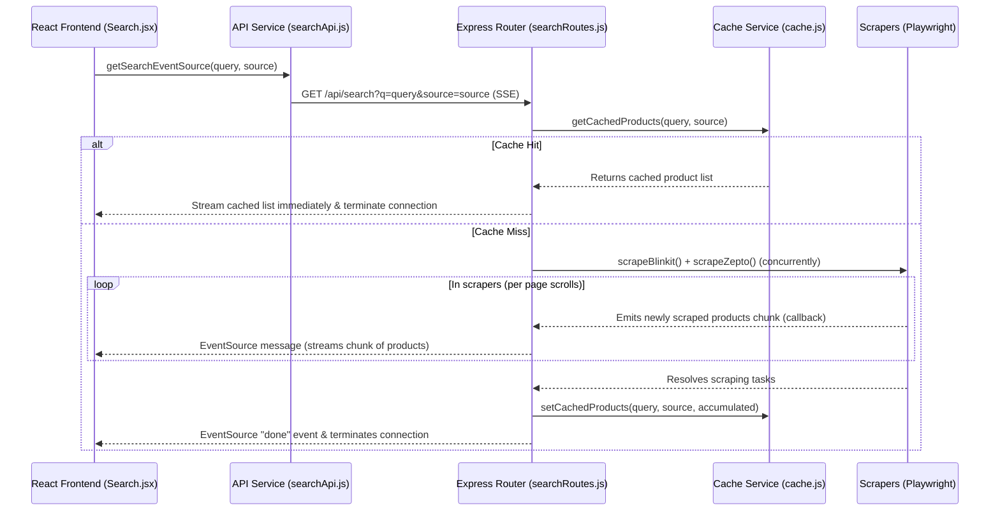

# Aggrify Project Map (AI Coding & Navigation Guide)

This document maps the project structure, features, dependencies, and flows to enable maximum AI coding efficiency.

---

## 1. Project Structure

```
Aggrify/
├── server.js                        # Root backend entry point
├── server/                          # Backend source
│   └── src/
│       └── features/
│           └── search/              # Backend search & scraper feature
│               ├── routes/          # Express route declarations
│               │   └── searchRoutes.js
│               ├── scrapers/        # Scraper implementations
│               │   ├── blinkitScraper.js
│               │   └── zeptoScraper.js
│               ├── services/        # Supporting services (Browser, Cache)
│               │   ├── browser.js
│               │   └── cache.js
│               └── README.md
├── frontend/                        # Frontend source
│   ├── src/
│   │   ├── main.jsx                 # Frontend entry point
│   │   ├── App.jsx                  # Main router config (lazy loaded)
│   │   ├── App.css
│   │   ├── index.css
│   │   └── features/
│   │       └── search/              # Frontend search feature
│   │           ├── components/      # UI components
│   │           │   ├── ProductCard.jsx
│   │           │   ├── StoreSelector.jsx
│   │           │   ├── SuggestionChips.jsx
│   │           │   └── FeatureHighlightGrid.jsx
│   │           ├── constants/       # Reusable constants
│   │           │   └── searchConstants.js
│   │           ├── pages/           # Pages (routed views)
│   │           │   ├── Home.jsx
│   │           │   └── Search.jsx
│   │           ├── services/        # Central API layer
│   │           │   └── searchApi.js
│   │           ├── utils/           # Business / matching algorithms
│   │           │   └── matching.js
│   │           └── README.md
│   ├── package.json
│   └── vite.config.js
├── tests/                           # Integration and Playwright tests
├── package.json                     # Root configuration
└── playwright.config.js
```

---

## 2. Feature & Routing Map

### Backend
- **Endpoint**: `/api/search`
  - Served via Server-Sent Events (SSE) in `server/src/features/search/routes/searchRoutes.js`.
  - Handles real-time scraping requests and streams results to the client.

### Frontend
- `/`: Home view (`Home.jsx`)
- `/search?q=<query>&source=<source>`: Search results view (`Search.jsx`)
- All pages are lazy-loaded via `App.jsx` dynamically inside `Suspense` wraps.

---

## 3. Data & API Flow



---

## 4. State Management

- **Local UI States**:
  - `searchInput` in pages to track typing.
  - `source` / `sourceParam` to track selected stores (synced with `localStorage` and `useSearchParams`).
  - `products` in `Search.jsx` stores the accumulated list of streamed results.
  - `view` (loading, error, no-results, results) manages display states.
- **Aggregated / Merged Product State**:
  - When new product chunks arrive in `Search.jsx`, `areProductsSame` (word-overlap algorithm in `utils/matching.js`) is used to compare new and existing items. If they match, their providers are merged to avoid duplicate cards.

---

## 5. Dependency Map

### Root / Backend
- `express`: Main web framework.
- `@playwright/test`: Launches Chromium for scraping.

### Frontend
- `react`, `react-dom` (React 19).
- `react-router-dom`: Handle client routing.
- `tailwindcss` (v4): Visual styles.

---

## 6. Where Common Tasks Should Be Implemented

| Task | File Path to Modify | Action |
|---|---|---|
| **Add a new scraper** (e.g., Instamart) | Create `server/src/features/search/scrapers/instamartScraper.js` | Implement scraping logic and update `searchRoutes.js` to call it. |
| **Change product matching criteria** | [matching.js](file:///home/veer/Project/Aggrify/frontend/src/features/search/utils/matching.js) | Tweak word similarity ratio or weight checking. |
| **Add brand normalization exception** | [searchConstants.js](file:///home/veer/Project/Aggrify/frontend/src/features/search/constants/searchConstants.js) | Add brand name to the `BRANDS` array. |
| **Add UI elements to product cards** | [ProductCard.jsx](file:///home/veer/Project/Aggrify/frontend/src/features/search/components/ProductCard.jsx) | Modify card UI structure and update presentation styling. |
| **Add query caching layer (Redis)** | [cache.js](file:///home/veer/Project/Aggrify/server/src/features/search/services/cache.js) | Replace in-memory cache logic. |
